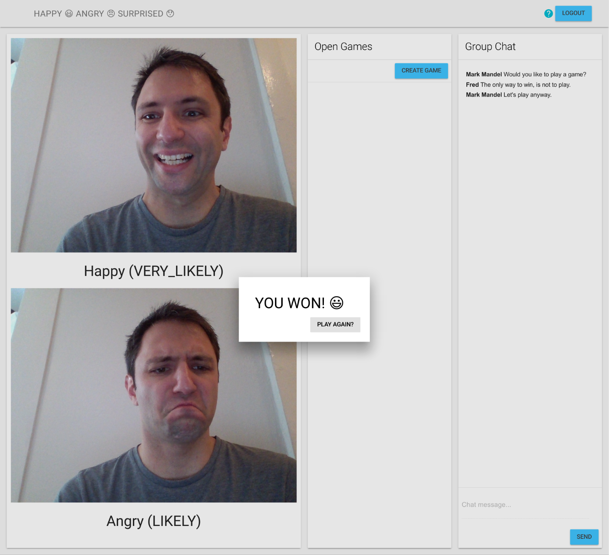

Multiplayer Happy, Angry, Surprised with Firebase
=============================================

Happy, Angry, Surprised is a very simple, silly, web based multiplayer game that works exactly the same as
Rock, Paper, Scissor - except with facial emotions.

The browser takes a photo of each of the player's faces, and depending on which emotion is displayed (determined through
[Cloud Vision API](https://cloud.google.com/vision/)), a player will win, lose or draw.

The rules are as follows:

- Angry beats Surprised
- Happy beats Angry
- Surprised beats Happy

## Running the Demo
You will need a [Firebase](https://firebase.google.com) project, and a
[Google Cloud Platform](https://cloud.google.com) project for the Cloud Vision API usage.

These should ideally be the same project, since it will make it much easier to run, but they don't have
to be.

### config.js

This is the file in which all configuration information goes. Currently it is set to placeholder values that will need to be replaced.

#### `firebase`

The firebase configuration will need to be retrieved from the project overview page, by clicking the "Add Firebase to your web app" button.

#### `visionAPI.key`

This is the API key that can be used for Vision API (which will need to be enabled on your project).

If your Firebase project has an enabled Google Cloud Platform project, you can use the same API Key as your Firebase
configuration.

If not, you will need to go to the [Developer Console > API Manager > Credentials](https://console.cloud.google.com/apis/credentials)
and create a new Browser API key.

**NOTE: DO NOT DO THIS IN PRODUCTION. PUTTING YOUR API KEY IN CLIENT CODE IS NOT A GOOD IDEA**

## Single Player / Test Mode
If you are testing on your own, append `?debug` to the URL, and it will make the picture taking countdown 
on that particular game increase to 10 seconds.

This means you can have two browser instances running, one with the standard countdown of five seconds, and one
with ten. This make testing with one computer much easier.

## Presentation Recordings
You can view the presentation that this demonstration was built around at the following URLs:

- [Google I/O 2016](https://www.youtube.com/watch?v=8wF-mKMsynE)

## Licence
Apache 2.0

This is not an official Google product.